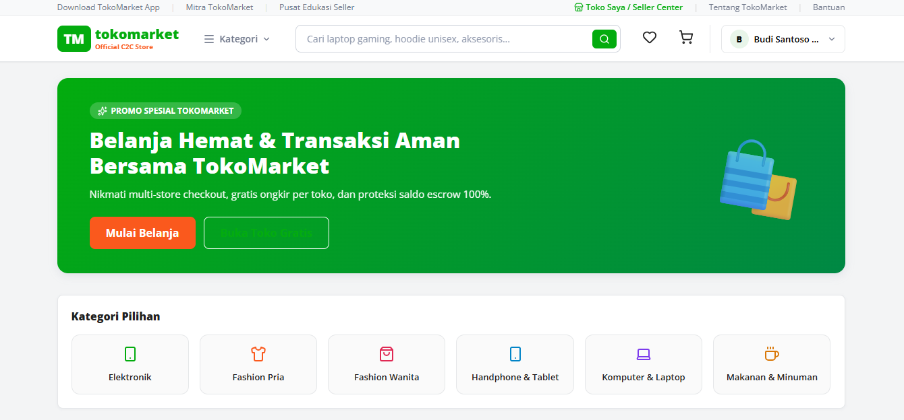
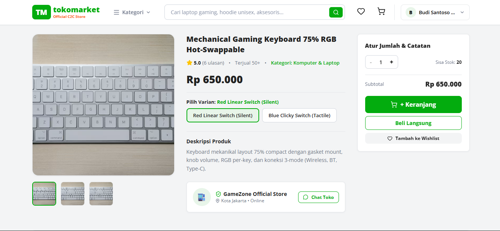

# TokoMarket - Fullstack C2C E-Commerce Platform

Marketplace Consumer-to-Consumer (C2C) berbasis web dengan arsitektur modular **Clean Architecture** pada backend Golang dan antarmuka **React.js** bergaya Tokopedia.

---

## 📸 Screenshots & Preview

| Beranda & Promo (Home) | Detail Produk & Varian |
| :---: | :---: |
|  |  |

| Keranjang Multi-Toko (Cart) | Checkout & Escrow |
| :---: | :---: |
|  |  |

| Seller Center & Saldo | Riwayat Pesanan & Ulasan |
| :---: | :---: |
|  |  |

---

## 🛠️ Tech Stack

### Backend
- **Language & Runtime:** Go (Golang) 1.21+
- **HTTP Framework:** Gin Gonic
- **ORM:** GORM
- **Database:** SQLite (Pure Go driver `glebarez/sqlite`, zero-CGO, kompatibel untuk migrasi ke PostgreSQL/MySQL)
- **Auth & Security:** JWT (Access & Refresh token), Bcrypt hashing, Role-Based Access Control (RBAC), CORS Middleware

### Frontend
- **Framework:** React 18 + Vite
- **Routing:** React Router v6
- **HTTP Client:** Axios (dengan token interceptor)
- **Icons:** Lucide React
- **Styling:** Vanilla CSS (Tokopedia Design System tokens, responsive, custom component system)

---

## ⚡ Fitur Utama

### 1. Autentikasi & Pemisahan Role (RBAC)
- Registrasi dengan opsi peran eksplisit: **Pembeli (Buyer)** dan **Penjual (Seller)**.
- Token JWT stateless dengan enkripsi password menggunakan Bcrypt.
- Proteksi route: akun Buyer tidak dapat membuat toko atau memanggil endpoint Seller Center (`403 Forbidden`).

### 2. Katalog Produk & Multi-Varian
- Pengelompokan produk berdasarkan kategori.
- Dukungan varian produk fleksibel (ukuran, warna, spesifikasi) dengan harga dan stok terpisah.
- Pencarian produk real-time, filter kategori, rating bintang, dan badge bebas ongkir.

### 3. Multi-Store Cart & Atomic Checkout
- Keranjang belanja dapat menampung barang dari beberapa toko sekaligus, dikelompokkan per merchant.
- Checkout multi-toko dalam satu database transaction atomik (`db.Transaction`) untuk mencegah *race condition* stok.
- Pilihan kurir pengiriman terpisah untuk masing-masing toko.

### 4. Sistem Escrow & Pelunasan Saldo
- Pembayaran ditahan oleh platform (*Escrow*) saat transaksi dibuat.
- Dana penjualan dan ongkir diteruskan ke saldo toko hanya setelah pembeli mengonfirmasi penerimaan barang (*Complete Order*).
- Simulasi webhook pembayaran (`SETTLEMENT`) untuk otomatisasi status pesanan.

### 5. Mesin Voucher & Promo
- Dukungan voucher platform dan voucher khusus toko.
- Tipe diskon: Persentase (dengan batas maksimal potongan) dan Potongan Tetap (*Fixed Amount*).
- Validasi minimum belanja, masa berlaku, dan kuota pemakaian.

### 6. Seller Center
- Manajemen produk toko (Tambah/Edit/Hapus produk beserta varian).
- Manajemen pesanan masuk dan input nomor resi pengiriman.
- Dashboard saldo toko dan penarikan dana (*Withdrawal*) ke rekening bank.
- Buku mutasi kas (audit trail debit & kredit).

### 7. Wishlist & Ulasan Produk
- Simpan barang favorit ke Wishlist.
- Ulasan rating bintang (1-5) dan komentar teks, khusus untuk barang yang telah berstatus selesai.

---

## 📁 Struktur Proyek

```text
go-market/
├── cmd/
│   └── api/
│       └── main.go                 # Entrypoint server backend
├── config/
│   ├── config.go                   # Environment loader
│   ├── database.go                 # Inisialisasi DB & AutoMigrate
│   └── seeder.go                   # Seeder data dummy
├── internal/
│   ├── domain/                     # Entity model, DTO, & interface bisnis
│   ├── repository/                 # Data access layer (GORM)
│   ├── usecase/                    # Business logic layer
│   └── delivery/
│       └── http/                   # HTTP handlers, router & middleware CORS/RBAC
├── pkg/
│   ├── hash/                       # Helper bcrypt
│   ├── jwt/                        # Helper token JWT
│   └── response/                   # Format standar response JSON
├── screenshots/                    # Tempat menyimpan file gambar screenshot UI
├── tests/
│   └── integration_test.go         # End-to-end integration test suite
├── frontend/                       # Client SPA React.js
│   ├── src/
│   │   ├── components/             # Navbar, Footer, ProductCard, AuthModal
│   │   ├── context/                # AuthContext, CartContext, WishlistContext
│   │   ├── pages/                  # Home, Detail, Cart, Checkout, Wishlist, Orders, Seller
│   │   ├── services/               # Axios API service layer
│   │   └── styles/                 # Tokopedia design tokens & global CSS
│   ├── index.html
│   └── package.json
├── test.http                       # Request collection REST Client
├── prd.md                          # Dokumentasi PRD Backend
├── prd-frontend.md                 # Dokumentasi PRD Frontend
└── README.md
```

---

## 👥 Akun Dummy untuk Pengujian

Semua akun menggunakan password: `Password123!`

| Role | Nama | Email | Keterangan |
| :--- | :--- | :--- | :--- |
| **Buyer** | Budi Santoso | `buyer@market.com` | Pembeli (dengan 2 alamat tersimpan) |
| **Seller** | Kevin Gadget | `gadget.seller@market.com` | Pemilik *Official Gadget Store* (Saldo: Rp 24.500.000) |
| **Seller** | Siti Fashion | `fashion.seller@market.com` | Pemilik *Urban Fashion Corner* (Saldo: Rp 11.800.000) |
| **Seller** | Rian Gaming | `gaming.seller@market.com` | Pemilik *GameZone Official Store* (Saldo: Rp 16.200.000) |

---

## 🚀 Menjalankan Aplikasi

### 1. Jalankan Backend
Pastikan Go 1.21+ sudah terinstall.
```bash
# Di root direktori project
go run ./cmd/api
```
Backend akan berjalan di `http://localhost:8080` dan otomatis melakukan migrasi database serta seeding data dummy pada start pertama.

### 2. Jalankan Frontend
Buka terminal baru:
```bash
cd frontend
npm install
npm run dev
```
Aplikasi frontend akan aktif di `http://localhost:5173`.

---

## 🧪 Testing

### Automated Integration Tests (Go)
Menjalankan seluruh skenario integration test:
```bash
go test -v ./tests
```

### Manual API Testing (REST Client)
Gunakan file `test.http` di VS Code / Antigravity dengan ekstensi REST Client untuk menguji endpoint secara interaktif.
